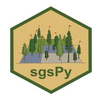

# sgsPy - Structurally Guided Sampling 

sgsPy is a toolbox package of stratification and sampling methods for use on ALS metrics, designed to be fast and efficient on very large raster images.

<!-- TODO: add numpy monthly downloads -->

 - **Documentation:** https://jbmeyer2001.github.io/sgsPy/
 - **Source Code:** https://github.com/jbmeyer2001/sgsPy/tree/main/sgspy
 - **Bug reports / Feature requests:** https://github.com/jbmeyer2001/sgsPy/issues

## Installation
sgsPy can be downloaded on either Windows or Linux from the Python Package Index (PyPI) with the following command:

``` pip install sgspy ```

## Overview
`sgsPy` is based on the widely-used `sgsR` package, intended originally to help develop representative ground sample networks using auxiliary 
information like ALS data. `sgsPy` takes much of the existing functionality of the R package and improves upon it's performance, 
allowing Python users to integrate structurally guided sampling approaches to their workflows.

While the original intention for the package was to be used with ALS metrics, any form of raster data can be used in lieu of ALS metrics.

If you encounter any bugs, unclear documentation, or have any feature ideas then please contribute by posting an issue. https://github.com/jbmeyer2001/sgsPy/issues

The currently implemented functionality includes:
 - **[calculating] [principal component analysis](https://jbmeyer2001.github.io/sgsPy/group__user__pca.html)**
 - **[sampling] [conditioned latin hypercube sampling](https://jbmeyer2001.github.io/sgsPy/group__user__clhs.html)**
 - **[sampling] [simple random sampling](https://jbmeyer2001.github.io/sgsPy/group__user__srs.html)**
 - **[sampling] [stratified random sampling](https://jbmeyer2001.github.io/sgsPy/group__user__strat.html)**
 - **[sampling] [systematic sampling](https://jbmeyer2001.github.io/sgsPy/group__user__systematic.html)**
 - **[stratification] [breaks](https://jbmeyer2001.github.io/sgsPy/group__user__breaks.html)**
 - **[stratification] [map](https://jbmeyer2001.github.io/sgsPy/group__user__map.html)**
 - **[stratification] [poly](https://jbmeyer2001.github.io/sgsPy/group__user__poly.html)**
 - **[stratification] [quantiles](https://jbmeyer2001.github.io/sgsPy/group__user__quantiles.html)**

## Quickstart guide
### files
Some helpful files to get started with can be found in the https://github.com/jbmeyer2001/sgsPy/tree/main/tests/files folder. Specifically
[mraster.tif](https://github.com/jbmeyer2001/sgsPy/blob/main/tests/files/mraster.tif), 
[inventory_polygons.shp](https://github.com/jbmeyer2001/sgsPy/blob/main/tests/files/inventory_polygons.shp) along with its associated .dbf, .prj, and .shx files, 
[access.shp](https://github.com/jbmeyer2001/sgsPy/blob/main/tests/files/access.shp) along with its associated .dbf, .prj, and .shx files, 
[existing.shp](https://github.com/jbmeyer2001/sgsPy/blob/main/tests/files/existing.shp) along with its associated .dbf, .prj, and .shx files.

### raster and vector data
The two data structures used by the stratification, sampling, and calculating methods are the `sgspy.SpatialRaster` [[SpatialRaster documentation](https://jbmeyer2001.github.io/sgsPy/classsgs_1_1utils_1_1raster_1_1SpatialRaster.html)] and `sgspy.SpatialVector` [[SpatialVector documentation](https://jbmeyer2001.github.io/sgsPy/classsgs_1_1utils_1_1vector_1_1SpatialVector.html)]. 
The beginning of any process using the sgspy package will involve creating one or more of these data structurse. This can be done by providing
a file path. It can also be done by converting from a data structure used by popular geospatial packages.

```
import sgspy

#creating SpatialRaster and SpatialVector using file paths
rast = sgspy.SpatialRaster("mraster.tif")
vect = sgspy.SpatialVector("access.shp")

#plotting
rast.plot(band=0)
rast.plot(band="pzabove2")

#accessing underlying data as a numpy array
zq90_arr = rast.band("zq90")
first_band_arr = rast.band(0)

#to/from GDAL raster dataset
ds = gdal.Open("mraster.tif")
rast = sgspy.SpatialRaster.from_gdal(ds)
new_ds = rast.to_gdal()

#to/from rasterio dataset
ds = rasterio.open("mraster.tif")
rast = sgspy.SpatialRaster.from_rasterio(ds)
new_ds = rast.to_rasterio()

#to/from geopandas
gdf = gpd.read_file("inventory_polygons.shp")
vect = sgspy.SpatialVector.from_geopandas(gdf)
new_gdf = gpd.to_geopandas(vect)
```

### example
More extensive examples on how to use each method is available in the [user documentation](https://jbmeyer2001.github.io/sgsPy/group__user.html). The following
shows how one might use three of the different methods available in sgspy to create a new sampling network.

```
import sgspy

# create SpatialRaster object from desired tif file
rast = sgspy.SpatialRaster("mraster.tif")

# use principal component analysis for dimensionality reduction (to two components or raster layers)
pca = sgspy.calculate.pca(rast, num_comp=2)

# stratifiy the two components into 5 equally sized quantiles, and map the two layers into a single mapped output
srast = sgspy.stratify.quantiles(pca, num_strata={"comp_1":5, "comp2":5}, map=True)

# use stratified random sampling to sample each (of the 25 total) mapped strata proportional to it's number of pixels in the raster band
# additionaly, plot the output and write it to samples.shp
samples = sgspy.sample.strat(srast, band="map_strat", num_samples=200, num_strata=25, allocation="prop", plot=True, filename="samples.shp")
```

## Funding
The development of the sgsPy package was funded by the Ontario Future Forests (KTTD 2B-2024) grant.

## Developer information
This section includes installation steps for both Windows and Linux, in addition to notes on running the code.
See the [Developer Documentation](https://jbmeyer2001.github.io/sgsPy/group__dev.html) for information on the underlying C++ implementations.

### Linux installation:
1. Ensure you have Python with pip installed, and git.
2. clone the repository with the following command:
```
git clone https://github.com/jbmeyer2001/sgsPy.git
```

3. create and activate a python virtual environment (**highly** recommended)
```
python -m venv .venv
source ./.venv/bin/activate
```

4. install dependency requirements. If you do not already have these, the dependency installation will fail.
 - build-essential (if you don't already have a C++ compiler)
 - pkg-config
 - auto-conf
 - libtool
 - bison
 - flex
 - patchelf

```
sudo apt install build-essential
sudo apt install pkg-config
sudo apt install auto-conf
sudo apt install libtool
sudo apt install bison
sudo apt install flex
sudo apt install patchelf
```

5. Run the following command to install and build project C++ dependencies.
```
bash scripts/install.sh
```

6. Run the following command to build the project
```
bash scripts/build.sh
```

7. If you intend to run the tests (using pytest), both pytest and geopandas are required and can be installed as follows:
```
pip install pytest
pip install geopandas
```

### Windows installation:
NOTE: The commands given are for a Windows Powershell command prompt.

1. ensure you have Python with pip, git, and a C++ compiler.

2. If you do not already have a C++ compiler, one can installed by installing the Microsoft Visual Studio IDE with C++ build tools.

3. clone the repository with the following command.
```
git clone https://github.com/jbmeyer2001/sgsPy.git
```

4. create and activate a Python virtual environment (**highly** recommended).
```
python -m venv .venv
./.venv/Scripts/activate
```

5. Run the following command to install and build project C++ dependencies. remaining dependencies
```
./scripts/install
```

6. Run the following command to build the project
```
./scripts/build
```

7. If you intend to run the tests (using pytest), both pytest and geopandas are required and can be installed as follow:
```
pip install pytest
pip install geopandas
```

### How to run sgsPy:

Tests may be ran by running the following command from within the folder containing this file. Both pytest and geopandas must be installed to run the tests.
```
pytest
```
